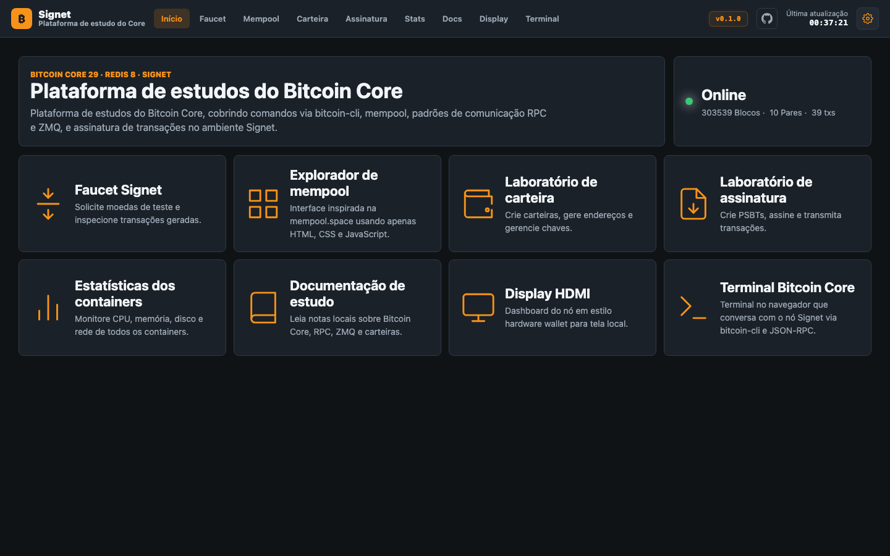
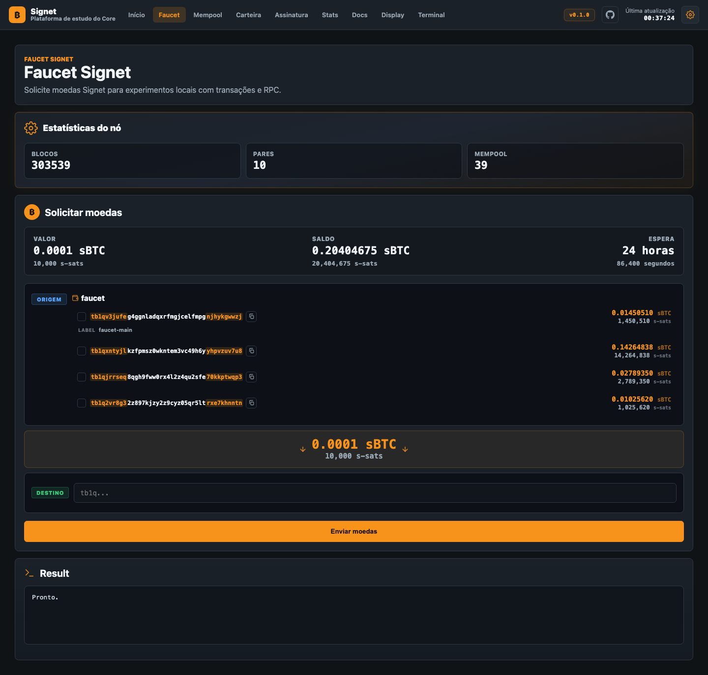
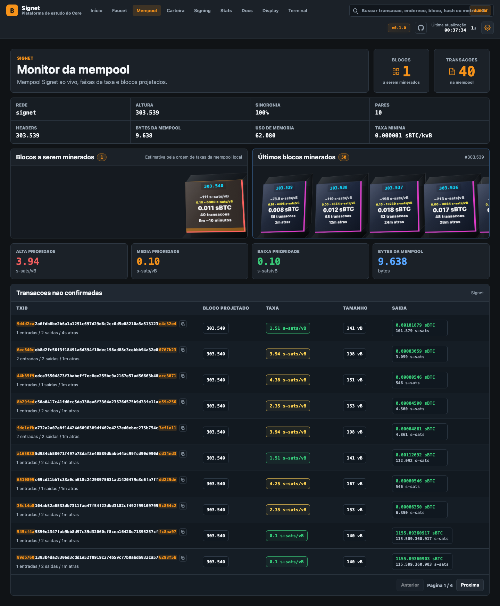
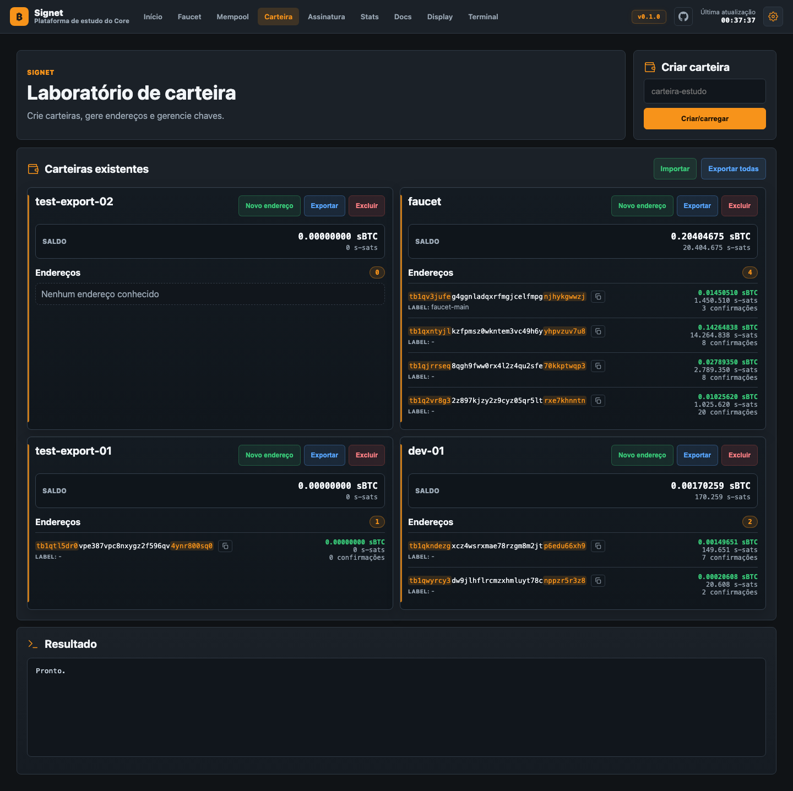
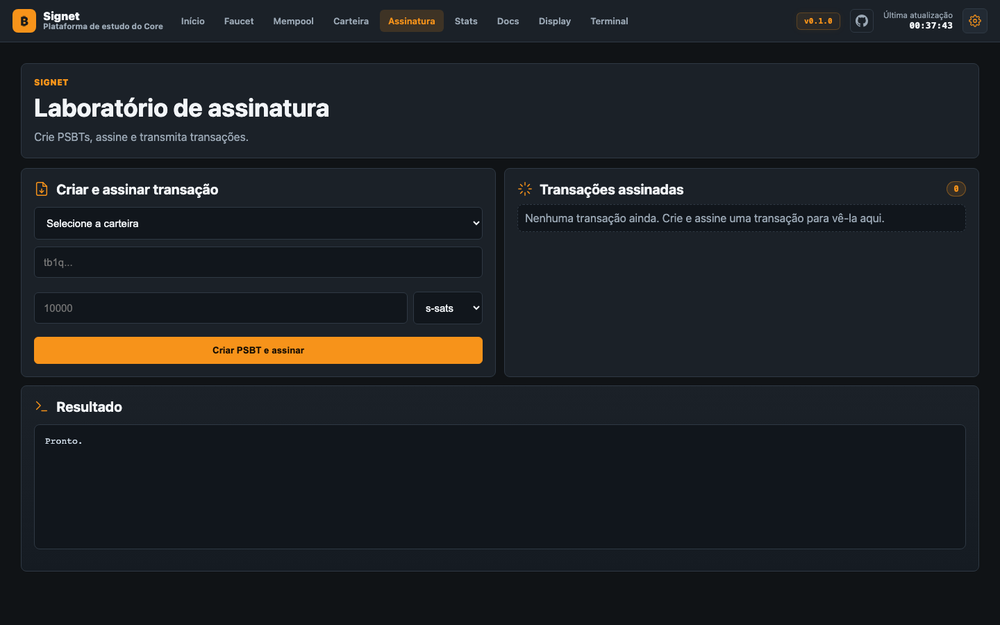
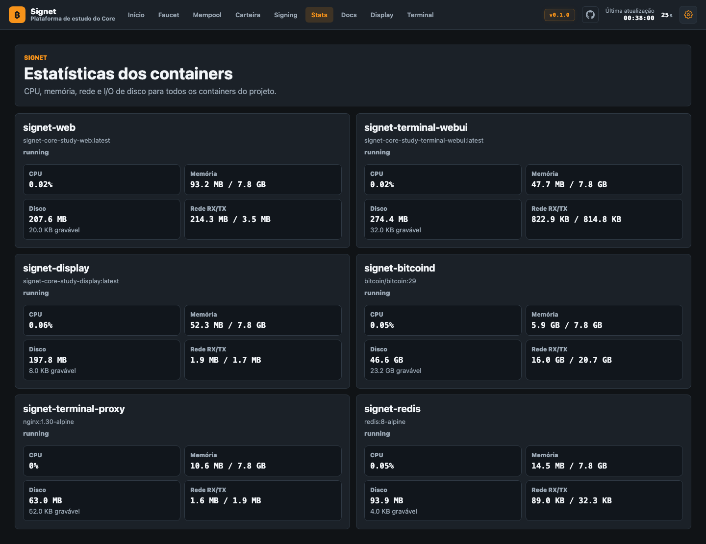
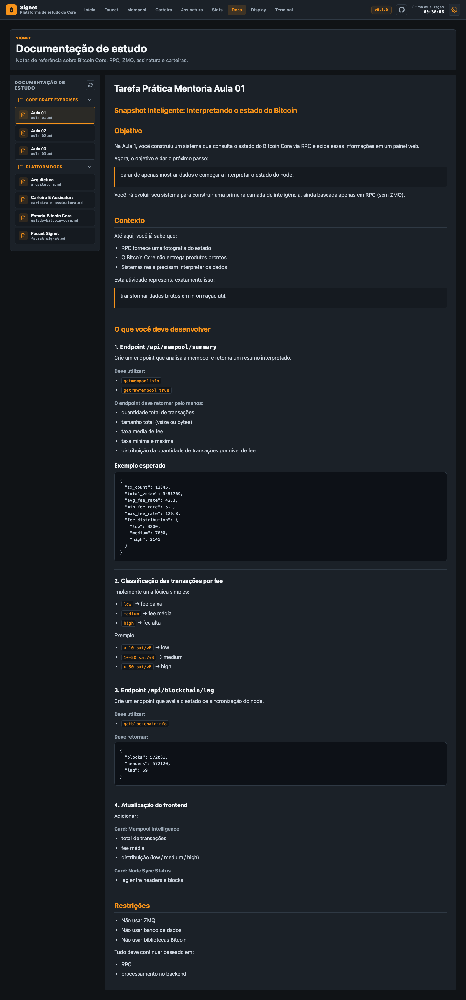
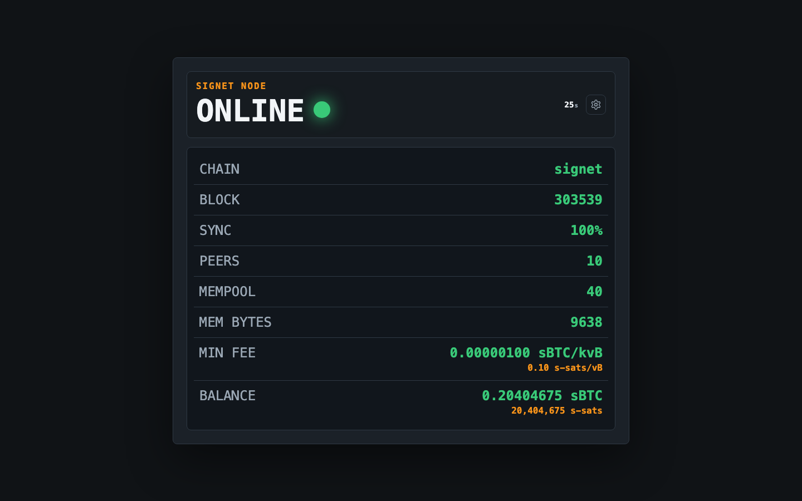
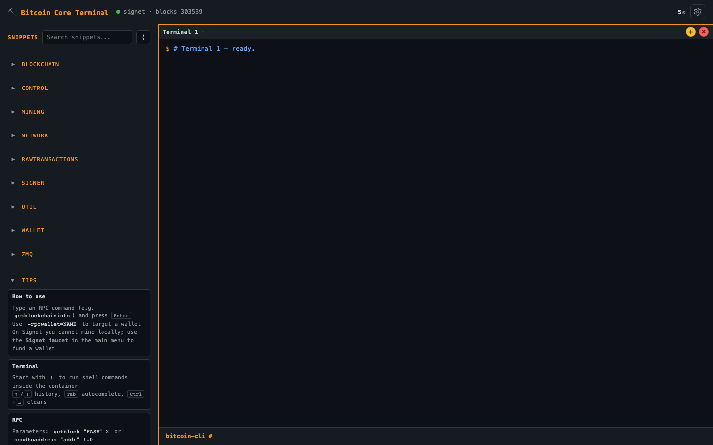

<div align="center">

# ⚡ Signet Core Study Platform

### Laboratório completo de Bitcoin Core para estudo — nó, faucet, mempool, gerenciamento de carteiras, assinatura de transações, dashboard HDMI e terminal `bitcoin-cli` no navegador, tudo em Signet.

[](https://bitcoincore.org/)
[](https://docs.docker.com/compose/)
[](https://www.python.org/)
[](https://fastapi.tiangolo.com/)
[](https://redis.io/)
[](https://nginx.org/)

[🇬🇧 English](README.md) · **🇧🇷 Português**

</div>

---

## 📸 Capturas de tela

<details>
<summary>Home — status do nó e cards de funcionalidades</summary>


</details>

<details>
<summary>Faucet — solicitar moedas de teste Signet</summary>


</details>

<details>
<summary>Mempool — explorador de mempool em tempo real</summary>


</details>

<details>
<summary>Lab de carteira — criar e gerenciar carteiras</summary>


</details>

<details>
<summary>Lab de assinatura — criar PSBTs, assinar e transmitir</summary>


</details>

<details>
<summary>Container stats — CPU, memória, disco, rede</summary>


</details>

<details>
<summary>Study docs — notas de referência locais</summary>


</details>

<details>
<summary>Display HDMI — dashboard kiosk</summary>


</details>

<details>
<summary>Terminal Bitcoin Core — bitcoin-cli no navegador</summary>


</details>

---

## ⚡ TL;DR — Início rápido

```bash
git clone <este repo>
cd bitcoin-core-study-platform
cp .env.example .env
# (opcional) edite .env — no mínimo troque BITCOIN_RPC_PASSWORD
docker compose up -d --build
chmod +x scripts/*.sh
./scripts/init-wallet.sh         # cria a wallet do faucet e imprime um endereço
open http://localhost:8080       # hub: faucet, mempool, wallet, signing, stats, docs
```

Pronto. Você tem um nó Signet `bitcoind` e quatro interfaces web ligadas a ele.

---

## 📖 Índice

- [⚡ Signet Core Study Platform](#-signet-core-study-platform)
    - [Laboratório completo de Bitcoin Core para estudo — nó, faucet, mempool, gerenciamento de carteiras, assinatura de transações, dashboard HDMI e terminal `bitcoin-cli` no navegador, tudo em Signet.](#laboratório-completo-de-bitcoin-core-para-estudo--nó-faucet-mempool-gerenciamento-de-carteiras-assinatura-de-transações-dashboard-hdmi-e-terminal-bitcoin-cli-no-navegador-tudo-em-signet)
  - [📸 Capturas de tela](#-capturas-de-tela)
  - [⚡ TL;DR — Início rápido](#-tldr--início-rápido)
  - [📖 Índice](#-índice)
  - [📦 O que vem na caixa](#-o-que-vem-na-caixa)
  - [✅ Pré-requisitos](#-pré-requisitos)
    - [Requisitos mínimos de sistema](#requisitos-mínimos-de-sistema)
    - [Tempo estimado de sincronização (IBD)](#tempo-estimado-de-sincronização-ibd)
  - [⚙️ Configuração (.env)](#️-configuração-env)
  - [🔐 Autenticação RPC: senha vs cookie](#-autenticação-rpc-senha-vs-cookie)
    - [`password` (padrão)](#password-padrão)
    - [`cookie`](#cookie)
  - [🚀 Subir a stack](#-subir-a-stack)
  - [🧪 Smoke test](#-smoke-test)
  - [🗂️ Estrutura do projeto](#️-estrutura-do-projeto)
  - [🌐 Hub web (porta 8080)](#-hub-web-porta-8080)
    - [Páginas](#páginas)
    - [Superfície de API](#superfície-de-api)
  - [🖥️ Display HDMI (porta 8181)](#️-display-hdmi-porta-8181)
  - [⛏️ Terminal Bitcoin Core (porta 8182)](#️-terminal-bitcoin-core-porta-8182)
    - [O que tem dentro](#o-que-tem-dentro)
    - [Como conversa com o nó](#como-conversa-com-o-nó)
    - [Hardening](#hardening)
  - [🔌 Portas](#-portas)
  - [🛡️ Arquitetura de rede](#️-arquitetura-de-rede)
  - [🔒 Hardening de segurança](#-hardening-de-segurança)
  - [📊 Painel de container stats (opt-in)](#-painel-de-container-stats-opt-in)
  - [📝 Study docs — adicionando documentos](#-study-docs--adicionando-documentos)
  - [💧 Wallet do faucet — fundos](#-wallet-do-faucet--fundos)
  - [🛠️ Scripts CLI](#️-scripts-cli)
  - [💾 Persistência e reset](#-persistência-e-reset)
  - [🔧 Troubleshooting](#-troubleshooting)
  - [📚 Referências](#-referências)

---

## 📦 O que vem na caixa

| Serviço            | Container               | Imagem / build                            | O que faz                                                |
| ------------------ | ----------------------- | ----------------------------------------- | -------------------------------------------------------- |
| **bitcoind**       | `signet-bitcoind`       | `bitcoin/bitcoin:29`                      | Nó completo em Signet, JSON-RPC :38332, ZMQ :28332-28335 |
| **redis**          | `signet-redis`          | `redis:8-alpine`                          | Cache + rate limit + histórico do faucet                 |
| **web**            | `signet-web`            | `apps/web` (FastAPI)                      | Home, faucet, mempool, wallet lab, signing lab, container stats, docs |
| **display**        | `signet-display`        | `apps/display` (FastAPI)                  | Dashboard HDMI/kiosk                                     |
| **terminal-webui** | `signet-terminal-webui` | `apps/terminal` (FastAPI + `bitcoin-cli`) | Sandbox que roda `bitcoin-cli` / RPC pelo navegador      |
| **terminal-proxy** | `signet-terminal-proxy` | `nginx:1.30-alpine`                       | Proxy reverso endurecido na frente do `terminal-webui`   |

Tudo via Docker; nada para instalar no host além do próprio Docker.

---

## ✅ Pré-requisitos

- Docker Engine e Docker Compose (plugin `docker compose` v2).
- Portas locais `8080`, `8181`, `8182` livres (o proxy bind apenas em `127.0.0.1`).

### Requisitos mínimos de sistema

| Recurso           | Mínimo                | Recomendado            | Observações                                                                  |
| ----------------- | --------------------- | ---------------------- | ---------------------------------------------------------------------------- |
| **CPU**           | 2 cores               | 4+ cores               | IBD (download inicial dos blocos) é intensivo em CPU; após a sincronização, 1 core é suficiente. |
| **RAM**           | 4 GB                  | 8 GB                   | `bitcoind` sozinho usa ~3–4 GB durante o IBD com `txindex=1`.               |
| **Armazenamento** | 40 GB SSD             | 60 GB+ SSD             | A chain Signet tem ~30 GB (maio 2026) e cresce ~5 GB/ano. **SSD fortemente recomendado** — HDD é 5–10× mais lento durante a sincronização. |
| **SO**            | Linux (x86_64/arm64)  | Ubuntu 22.04+ / Debian 12+ | Também roda em macOS e Windows (WSL2) para desenvolvimento.            |
| **Rede**          | Banda larga           | 50+ Mbps               | Baixa ~30 GB de dados de blocos durante o IBD.                              |

> [!TIP]
> **Raspberry Pi 5 (8 GB) + NVMe** é a melhor opção single-board — sincroniza em menos de 1 hora.
> **Raspberry Pi 4 (8 GB) + SSD** também funciona bem para um laboratório permanente (~3 horas).
> Os **modelos de 4 GB** são apertados: o Bitcoin Core pode dar OOM durante o IBD. Use `dbcache=300` no `bitcoin.conf` para reduzir o uso de memória.

### Tempo estimado de sincronização (IBD)

A chain Signet possui ~303.000 blocos (maio 2026). O tempo de IBD varia conforme o hardware:

| Hardware                                | Tempo estimado de IBD | Observações                                   |
| --------------------------------------- | --------------------- | --------------------------------------------- |
| PC moderno (NVMe + 4+ cores)           | ~15–20 min            | Cenário mais rápido.                          |
| PC intermediário (SSD + 2 cores)       | ~30–45 min            | Laptop típico.                                |
| PC antigo / laptop básico (SSD)        | ~1–2 horas            | Hardware mais antigo, ainda utilizável.       |
| Raspberry Pi 5 (NVMe HAT)             | ~40–60 min            | Melhor opção single-board. Cortex-A76 + PCIe. |
| Raspberry Pi 5 (SSD USB)              | ~1–2 horas            | Boa opção, levemente mais lento que NVMe.     |
| Raspberry Pi 5 (cartão SD)            | ~4–6 horas            | Utilizável mas lento — prefira NVMe ou SSD.  |
| Raspberry Pi 4 (SSD USB)              | ~2–3 horas            | Escolha sólida para laboratório dedicado.     |
| Raspberry Pi 4 (cartão SD)            | ~8–12 horas           | **Não recomendado** — I/O muito lento.       |

Após o IBD, o nó mantém-se sincronizado com uso mínimo de CPU (~1% em repouso).

```bash
docker --version
docker compose version
```

---

## ⚙️ Configuração (.env)

Um único `.env` na raiz do projeto configura **tudo**. Copie o template uma vez:

```bash
cp .env.example .env
```

Variáveis principais (lista completa em [`.env.example`](.env.example)):

| Variável                                              | Para quê                                                              |
| ----------------------------------------------------- | --------------------------------------------------------------------- |
| `APP_TITLE` · `DEFAULT_LANG`                          | Branding e idioma padrão (`pt-BR` ou `en-GB`).                        |
| `BITCOIN_REPO` · `BITCOIN_VERSION`                    | Tag da imagem do Bitcoin Core (usada por `bitcoind` e pelo terminal). |
| `PYTHON_IMAGE` · `NGINX_IMAGE`                        | Imagens base dos apps FastAPI e do proxy do terminal.                 |
| `BITCOIN_RPC_AUTH_MODE`                               | `password` (padrão) ou `cookie` — veja a próxima seção.               |
| `BITCOIN_RPC_USER` · `BITCOIN_RPC_PASSWORD`           | Credenciais no modo password.                                         |
| `BITCOIN_RPC_COOKIE_FILE`                             | Caminho do cookie dentro dos containers (default já funciona).        |
| `BITCOIN_RPC_URL`                                     | URL RPC interna, default `http://bitcoind:38332`.                     |
| `FAUCET_*` · `MAX_WALLET_SEND_BTC`                    | Limites do faucet e teto do laboratório de assinatura.                |
| `TURNSTILE_*`                                         | CAPTCHA opcional do Cloudflare Turnstile no faucet.                   |
| `BASIC_AUTH_USERNAME` · `BASIC_AUTH_PASSWORD`         | HTTP Basic auth opcional cobrindo todas as superfícies.               |
| `TRUST_PROXY_HEADERS`                                 | Aceitar `X-Forwarded-For` (somente atrás de proxy de confiança).      |
| `DISPLAY_URL` · `TERMINAL_URL`                        | URLs do Display e Terminal nos links de navegação (default `http://localhost:8181` / `8182`). |
| `TERMINAL_HOST_PORT`                                  | Porta do host para o proxy do terminal (default `8182`).              |
| `SEARCH_RATE_PER_MIN` · `MEMPOOL_DETAIL_RATE_PER_MIN` | Rate limit por IP.                                                    |
| `REFRESH_MEMPOOL` · `REFRESH_STATS`                   | Intervalo de atualização automática em segundos para mempool (padrão 5) e stats (padrão 30). |
| `REFRESH_DISPLAY` · `REFRESH_TERMINAL`                | Intervalo de atualização para display HDMI (padrão 30) e terminal (padrão 10).               |
| `APP_VERSION`                                         | Versão exibida no badge do cabeçalho (padrão `0.1.1`).               |
| `ENABLE_CONTAINER_STATS`                              | Mostra CPU/memória/disco dos containers (precisa do override).        |

> [!IMPORTANT]
> Não comite `.env`. O `.gitignore` já protege.

---

## 🔐 Autenticação RPC: senha vs cookie

Dois modos, alternados pela variável `BITCOIN_RPC_AUTH_MODE` no `.env`.

### `password` (padrão)

`bitcoind` sobe com `-rpcuser=$BITCOIN_RPC_USER -rpcpassword=$BITCOIN_RPC_PASSWORD`. Todos os clientes (web, display, terminal, scripts, `bitcoin-cli` interno) leem a mesma dupla do `.env`. Simples, mas a senha fica em variáveis de ambiente em vários containers.

### `cookie`

`bitcoind` não recebe `-rpcuser` / `-rpcpassword` — ele gera automaticamente `~/.bitcoin/signet/.cookie` com `__cookie__:<hex-aleatório>`. O volume Docker `bitcoin-data` é montado **somente leitura** em todos os clientes em `/bitcoind-data`, então:

- `apps/web`, `apps/display` e o backend Python do `terminal-webui` leem o cookie via `BITCOIN_RPC_COOKIE_FILE=/bitcoind-data/signet/.cookie`.
- O `bitcoin-cli` dentro do sandbox do terminal é configurado com `rpccookiefile=...` em vez de `rpcuser=...` (veja [`apps/terminal/entrypoint.sh`](apps/terminal/entrypoint.sh)).
- Os scripts em `scripts/` chamam `bitcoin-cli` dentro do container `signet-bitcoind`, que já tem acesso ao próprio cookie — não precisam de credenciais.

A troca é uma única variável:

```ini
BITCOIN_RPC_AUTH_MODE=cookie
```

depois `docker compose up -d --build`. O bitcoind regenera o cookie a cada start; nenhum cliente cacheia o caminho.

---

## 🚀 Subir a stack

```bash
docker compose up -d --build
chmod +x scripts/*.sh
./scripts/init-wallet.sh
./scripts/status.sh             # blockchain / rede / mempool / ZMQ / wallet do faucet
```

Abra:

```text
http://localhost:8080            # Hub web (home + faucet + mempool + wallet + signing + stats + docs)
http://localhost:8181            # Display HDMI
http://localhost:8182            # Terminal Bitcoin Core
```

Todas as UIs alternam entre `pt-BR` e `en-GB` no menu de engrenagem.

---

## 🧪 Smoke test

```bash
# Snapshot completo (usa o .env)
./scripts/status.sh

# Heartbeat do hub web
curl http://localhost:8080/api/status | jq .

# Heartbeat do terminal
curl http://localhost:8182/api/health | jq .

# bitcoin-cli dentro do container bitcoind
docker exec signet-bitcoind bitcoin-cli -signet \
  -rpcuser="$BITCOIN_RPC_USER" -rpcpassword="$BITCOIN_RPC_PASSWORD" \
  getblockchaininfo
```

---

## 🗂️ Estrutura do projeto

```text
bitcoin-core-study-platform/
├── apps/
│   ├── web/                       Hub FastAPI (porta 8080)
│   │   ├── Dockerfile
│   │   ├── requirements.txt
│   │   └── app/
│   │       ├── main.py            FastAPI factory + include_router
│   │       ├── templates.py       Jinja2Templates singleton
│   │       ├── core/              env, cliente RPC, segurança, cache, validators
│   │       ├── routes/            pages, blockchain, mempool, search, faucet, wallet, stats
│   │       ├── static/            css/, js/, img/
│   │       └── templates/         home, faucet, mempool, wallet, signing, stats, docs
│   │
│   ├── display/                   Kiosk HDMI (porta 8181)
│   │   ├── Dockerfile
│   │   ├── requirements.txt
│   │   └── app/{main.py, rpc.py, static/, templates/}
│   │
│   └── terminal/                  bitcoin-cli no navegador (porta 8182, atrás do nginx)
│       ├── Dockerfile             two-stage: pega bitcoin-cli da imagem do bitcoind
│       ├── entrypoint.sh          renderiza ~/.bitcoin/bitcoin.conf a partir do env
│       ├── nginx.conf             config do proxy reverso
│       ├── requirements.txt
│       ├── version.txt            mostrado na UI
│       ├── backend/app.py         RPC + endpoint /api/exec do sandbox
│       └── webui/static/          frontend (HTML/CSS/JS + i18n)
│
├── bitcoind/
│   ├── bitcoin.conf               config base (signet=1, ZMQ, txindex)
│   └── entrypoint.sh              alterna o modo de auth conforme o env
│
├── docs/                          notas de estudo montadas read-only no app web
├── scripts/                       helpers bash em cima do bitcoin-cli
├── systemd/                       serviço opcional de kiosk para Raspberry Pi
├── compose.yml                    stack principal
├── compose.stats.yml              override opt-in para a página /stats
├── .env.example                   única fonte de configuração
├── README.md                      versão em inglês
└── README.pt-BR.md                este arquivo
```

---

## 🌐 Hub web (porta 8080)

App único FastAPI que serve cada página + API do laboratório.

### Páginas

| Path          | O que aparece                                                                   |
| ------------- | ------------------------------------------------------------------------------- |
| `/`           | Home — status do nó + cards para cada superfície.                                     |
| `/faucet`     | Solicitação de sBTC; rate limit por IP e por endereço.                                |
| `/mempool`    | Explorador inspirado no mempool.space (HTML/CSS/JS puro).                             |
| `/wallet`     | Lab de carteira: criar/carregar/excluir wallets, gerar endereços, gerenciar chaves.   |
| `/signing`    | Lab de assinatura: criar PSBTs, assinar e transmitir transações.                      |
| `/stats`      | Estatísticas dos containers (CPU/mem/disco/rede), opt-in.                             |
| `/study-docs` | Notas locais de Bitcoin Core / RPC / ZMQ / wallet em `docs/`.                         |

### Superfície de API

Endpoints de leitura (timeout curto, com rate limit):

| Método | Path                                        | Para quê                                                        |
| ------ | ------------------------------------------- | --------------------------------------------------------------- |
| `GET`  | `/api/status`                               | Snapshot para a home / faucet.                                  |
| `GET`  | `/api/zmq`                                  | `getzmqnotifications`.                                          |
| `GET`  | `/api/rpc-help?command=...`                 | `help <command>` (nome validado).                               |
| `GET`  | `/api/blocks/recent?limit=N`                | Blocos minerados recentes com fee stats.                        |
| `GET`  | `/api/blocks/{height}/txs`                  | Detalhe de bloco minerado.                                      |
| `GET`  | `/api/mempool` · `/api/mempool/raw`         | `getmempoolinfo`, `getrawmempool`.                              |
| `GET`  | `/api/mempool/txs?limit=N`                  | Lista de TXs do mempool com endereços, fees, blocos projetados. |
| `GET`  | `/api/mempool/tx/{txid}`                    | Detalhe completo da TX (rate-limited).                          |
| `GET`  | `/api/mempool/blocks`                       | Resumo de blocos projetados (buckets de fee).                   |
| `GET`  | `/api/mempool/projected-block/{n}`          | Detalhe de cada bloco projetado (rate-limited).                 |
| `GET`  | `/api/search/address/{addr}`                | Visão de um endereço, cache 60s, rate-limited por IP.           |
| `GET`  | `/api/history`                              | Últimos envios do faucet.                                       |
| `GET`  | `/api/wallet/list` · `/api/wallet/overview` | Wallets carregadas + saldos/endereços.                          |
| `GET`  | `/api/container-stats`                      | Stats dos containers (`ENABLE_CONTAINER_STATS=true`).           |

Endpoints de escrita (timeout maior):

| Método | Path                        | Para quê                                       |
| ------ | --------------------------- | ---------------------------------------------- |
| `POST` | `/api/request`              | Envio do faucet.                               |
| `POST` | `/api/wallet/create`        | Cria ou carrega uma wallet.                    |
| `POST` | `/api/wallet/create-faucet` | Cria a wallet do faucet + retorna um endereço. |
| `POST` | `/api/wallet/load`          | Carrega uma wallet existente.                  |
| `POST` | `/api/wallet/delete`        | Exclui (precisa estar com saldo zero).         |
| `POST` | `/api/wallet/address`       | Novo endereço de recebimento.                  |
| `POST` | `/api/wallet/sign`          | Constrói + assina um PSBT (NÃO faz broadcast). |
| `POST` | `/api/wallet/broadcast`     | `sendrawtransaction` para um hex assinado.     |
| `GET`  | `/api/wallet/export?wallet=X` | Exporta uma carteira (descritores + chaves). |
| `GET`  | `/api/wallet/export-all`    | Exporta todas as carteiras em um único JSON.   |
| `POST` | `/api/wallet/import`        | Importa carteiras de um arquivo JSON exportado.|
| `POST` | `/api/docs/rebuild-manifest` | Escaneia `docs/` e regenera `manifest.json`. |

> [!CAUTION]
> Os endpoints de wallet foram desenhados para um **lab em `127.0.0.1`**. Se publicar a stack, proteja com `BASIC_AUTH_USERNAME` / `BASIC_AUTH_PASSWORD` (ou um proxy reverso real com autenticação) — não há auth por endpoint.

---

## 🖥️ Display HDMI (porta 8181)

App FastAPI minúsculo que renderiza uma tela no estilo "hardware wallet" para um monitor de kiosk. A unit em [`systemd/signet-display-kiosk.service`](systemd/signet-display-kiosk.service) abre o Chromium em modo kiosk apontando para `http://localhost:8181`.

```bash
sudo cp systemd/signet-display-kiosk.service /etc/systemd/system/
sudo systemctl enable --now signet-display-kiosk.service
```

`GET /api/status` retorna o mesmo JSON consumido pela tela — útil para qualquer dashboard externo.

---

## ⛏️ Terminal Bitcoin Core (porta 8182)

Adaptado de [`gustavoschaedler/bitcoin-core-terminal`](https://github.com/gustavoschaedler/bitcoin-core-terminal), redirecionado ao nó Signet deste projeto.

### O que tem dentro

- **Prompt no estilo `bitcoin-cli`**: digite `getblockchaininfo`, `getmempoolinfo`, `listwallets` etc. Aspas e parâmetros JSON são parseados.
- **Escape de shell**: comece a linha com `!` para rodar comando de shell no sandbox (`jq`, `grep`, `sed`, `less` já vêm).
- **Sidebar de snippets** com busca, expandir/recolher e autocomplete via `Tab`/`→`.
- **Splits e histórico**: múltiplos painéis; `↑`/`↓` por painel; `Ctrl+L` limpa.
- **Idiomas**: alternância entre English (UK) e Português (Brasil).
- **API HTTP**: `/api/health`, `/api/meta`, `/api/wallets`, `/api/rpc`, `/api/exec`, `/api` (Swagger).

### Como conversa com o nó

```text
Navegador
  │  HTTP :8182 (somente 127.0.0.1)
  ▼
terminal-proxy (nginx)
  ▼
terminal-webui (FastAPI + bitcoin-cli)
  ▼  JSON-RPC :38332 (senha OU cookie)
signet-bitcoind  (compartilhado com web, display, faucet)
```

### Hardening

O container `terminal-webui` roda como `sandbox` (uid 1000), `read_only: true`, com `/tmp` e `~/.bitcoin` em `tmpfs`, todas as capabilities removidas e `no-new-privileges`. O `terminal-proxy` mantém o conjunto mínimo de capabilities que o nginx precisa para abrir porta. Ambos só ouvem em `127.0.0.1`.

`/api/exec`:

- limita stdout/stderr em ~1 MiB;
- timeout default 30 s, máximo 120 s;
- roda o processo em um novo grupo e mata a árvore inteira no timeout;
- restringe `cwd` a uma allow-list (`$HOME`, `/tmp`, `/app`) — recusa outros caminhos com `exec_cwd_forbidden`.

> [!WARNING]
> `/api/exec` executa **shell arbitrário** como usuário `sandbox` dentro do container. Nunca exponha essa superfície fora de `127.0.0.1` sem um proxy reverso com autenticação.

---

## 🔌 Portas

| Escopo                | Endereço                            | Observação                          |
| --------------------- | ----------------------------------- | ----------------------------------- |
| Hub web               | `127.0.0.1:8080` → `web`            | Faucet, mempool, wallet, signing, stats. |
| Display HDMI          | `127.0.0.1:8181` → `display`        | Dashboard kiosk.                    |
| Terminal Bitcoin Core | `127.0.0.1:8182` → nginx → terminal | Sandbox `bitcoin-cli` no navegador. |
| RPC (interno)         | `bitcoind:38332`                    | Não publicado no host.              |
| P2P (interno)         | `bitcoind:38333`                    | Não publicado.                      |
| ZMQ (interno)         | `bitcoind:28332..28335`             | Não publicado.                      |
| Redis (interno)       | `redis:6379`                        | Não publicado.                      |

---

## 🛡️ Arquitetura de rede

```text
Navegador
  │
  ├── 8080 ──▶ web (FastAPI)
  ├── 8181 ──▶ display (FastAPI)
  └── 8182 ──▶ terminal-proxy (nginx) ──▶ terminal-webui (FastAPI)
                                              │
                                              ▼
                                          bitcoind (JSON-RPC, ZMQ)
                                              ▲
                                          redis ◀── web (rate limit + cache)
```

Todos os binds do host vão por padrão em `127.0.0.1`. RPC, ZMQ, P2P e Redis ficam contidos na rede do Compose.

---

## 🔒 Hardening de segurança

A base de código foi auditada e endurecida. Pontos principais:

- **Cookie auth suportada** ao lado de user/senha — `BITCOIN_RPC_AUTH_MODE=cookie` tira a senha das envs dos apps.
- **Address search com rate limit** (`SEARCH_RATE_PER_MIN`, default 6/min/IP). O caminho `?refresh=true` (mais caro) tem cota própria, mais estrita.
- **Endpoints de detalhe de mempool com rate limit** (`MEMPOOL_DETAIL_RATE_PER_MIN`, default 60/min/IP).
- **Timeouts RPC menores** — leituras default 15 s; só escritas (faucet, wallet) ganham 30 s.
- **Content-Security-Policy** aplicado em todas as respostas (permite o Cloudflare Turnstile).
- **Headers padrão**: `X-Content-Type-Options: nosniff`, `X-Frame-Options: DENY`, `Referrer-Policy: no-referrer`, `Permissions-Policy: camera=(), microphone=(), geolocation=()`.
- **HTTP Basic auth opcional** (`BASIC_AUTH_*`) cobre todas as superfícies web.
- **Allow-list para `cwd` em `/api/exec`** — o sandbox do terminal recusa `cwd` fora de `$HOME`, `/tmp` ou `/app`.
- **Validação rigorosa** em todos os endpoints de wallet: regex de nome, prefixo signet/testnet + `validateaddress`, regex de raw-tx hex, teto de valor decimal.
- **Containers somente leitura**: `terminal-webui` roda `read_only: true` com tmpfs; ambos os containers do terminal têm `cap_drop: [ALL]` e `no-new-privileges`.
- **Trust-proxy headers desligado por default** — só honra `X-Forwarded-For` quando `TRUST_PROXY_HEADERS=true`.
- **Nada de credencial em log** — erros de RPC retornam ao cliente sem ecoar URL ou tupla de auth.

Para exposição na internet, adicione:

- bind apenas em `127.0.0.1` e proxy reverso real (Caddy/Nginx/Traefik/Cloudflare Tunnel);
- HTTPS obrigatório;
- ative `BASIC_AUTH_*`;
- ative `TURNSTILE_ENABLED=true` no faucet;
- mantenha `ENABLE_CONTAINER_STATS=false`;
- nunca exponha `/wallet`, `/signing`, `/api/wallet/*`, `/api/exec`, RPC, ZMQ, Redis ou Docker socket;
- mantenha pouco saldo na wallet do faucet;
- `TRUST_PROXY_HEADERS=true` apenas se o proxy é seu.

---

## 📊 Painel de container stats (opt-in)

A página `/stats` fica desabilitada por padrão. Para ativar em laboratório local de confiança:

```bash
# .env
ENABLE_CONTAINER_STATS=true
```

```bash
docker compose -f compose.yml -f compose.stats.yml up -d --build
```

O override monta `/var/run/docker.sock` somente leitura no container `web` e roda esse container como `root`. Conveniente localmente; **nunca exponha**.

Ele só reporta containers do projeto: `signet-bitcoind`, `signet-redis`, `signet-web`, `signet-display`, `signet-terminal-webui`, `signet-terminal-proxy`.

---

## 📝 Study docs — adicionando documentos

A página `/study-docs` renderiza arquivos Markdown do diretório `docs/`. Os documentos são organizados por **seção** (um subdiretório de primeiro nível) e **locale** (um subdiretório dentro de cada seção seguindo o padrão i18n `en-gb`, `pt-br`, etc.).

### Layout dos diretórios

```text
docs/
├── manifest.json                  ← definição do menu lateral (gerado automaticamente)
├── platform-docs/                 ← seção
│   ├── en-gb/                     ← locale
│   │   ├── architecture.md
│   │   └── wallet-and-signing.md
│   └── pt-br/
│       ├── arquitetura.md
│       └── carteira-e-assinatura.md
└── core-craft-exercises/          ← outra seção
    ├── en-gb/
    │   ├── lesson-01.md
    │   └── lesson-02.md
    └── pt-br/
        ├── aula-01.md
        └── aula-02.md
```

### Adicionando novos documentos

1. **Crie uma seção** (ou reuse uma existente): adicione um diretório em `docs/`, ex.: `docs/meu-topico/`.
2. **Adicione subdiretórios de locale**: crie `en-gb/` e/ou `pt-br/` dentro da seção.
3. **Escreva os arquivos Markdown**: coloque arquivos `.md` no diretório de locale apropriado. Os arquivos são pareados entre locales pela ordem alfabética dentro de cada seção — mantenha a quantidade de arquivos consistente entre os locales.
4. **Reconstrua o manifesto**: clique no **botão de rebuild** (↻) no canto superior direito da sidebar do Study Docs, ou chame a API diretamente:

```bash
curl -X POST http://localhost:8080/api/docs/rebuild-manifest
```

O endpoint escaneia cada diretório de seção, descobre pastas de locale e arquivos `.md`, pareia por índice ordenado e grava um novo `docs/manifest.json`. A página recarrega automaticamente com a sidebar atualizada.

### Fallback de idioma

Quando um documento não está disponível no idioma selecionado, o visualizador faz fallback para `en-gb`, e depois para qualquer outro locale disponível. Isso significa que você pode começar com um único idioma e adicionar traduções depois.

### Formato do manifest.json

O rebuild gera esta estrutura (você também pode editá-lo manualmente para ajustes finos):

```json
[
  {
    "section": "platform-docs",
    "title": { "en-gb": "Platform Docs", "pt-br": "Docs da Plataforma" },
    "docs": [
      { "key": "architecture", "en-gb": "architecture.md", "pt-br": "arquitetura.md" }
    ]
  }
]
```

Os títulos das seções são gerados a partir do nome do diretório em title-case. Edite o objeto `"title"` manualmente para traduções adequadas.

---

## 💧 Wallet do faucet — fundos

Esta stack não minera. O faucet só envia o que está em `FAUCET_WALLET_NAME`.

```bash
./scripts/init-wallet.sh         # cria a wallet, imprime um endereço
./scripts/new-address.sh         # endereços extras
```

Mande sBTC de um faucet Signet público para o endereço impresso. Após confirmação, `/faucet` distribui `FAUCET_AMOUNT_BTC` por solicitação, respeitando `FAUCET_COOLDOWN_SECONDS` por endereço e `FAUCET_MAX_PER_IP_PER_DAY` por IP.

**Faucets Signet externos:**
- <https://signet257.bublina.eu.org/>
- <https://signetfaucet.com>
- <https://bitcoinsignetfaucet.com/>

---

## 🛠️ Scripts CLI

Todos chamam `bitcoin-cli` dentro do `signet-bitcoind`, escolhendo automaticamente o modo de auth conforme `BITCOIN_RPC_AUTH_MODE`.

| Script                                             | O que faz                                    |
| -------------------------------------------------- | -------------------------------------------- |
| [`scripts/common.sh`](scripts/common.sh)           | Helper interno usado pelos demais.           |
| [`scripts/bitcoin-cli.sh`](scripts/bitcoin-cli.sh) | Roda qualquer `bitcoin-cli ...` no nó.       |
| [`scripts/init-wallet.sh`](scripts/init-wallet.sh) | Carrega ou cria a wallet do faucet.          |
| [`scripts/status.sh`](scripts/status.sh)           | Blockchain / rede / mempool / ZMQ / faucet.  |
| [`scripts/mempool.sh`](scripts/mempool.sh)         | `getmempoolinfo` e a lista raw do mempool.   |
| [`scripts/new-address.sh`](scripts/new-address.sh) | Novo endereço de recebimento na wallet.      |
| [`scripts/send-test.sh`](scripts/send-test.sh)     | `./scripts/send-test.sh <endereço> <valor>`. |

---

## 💾 Persistência e reset

O estado vive em dois volumes nomeados: `bitcoin-data` (datadir Signet completo + cookie) e `redis-data` (histórico do faucet + cache + rate limit).

```bash
# Para sem apagar dados:
docker compose down

# Reset total (apaga wallets, blocos, histórico do faucet):
docker compose down -v
```

---

## 🔧 Troubleshooting

<details>
<summary><code>Could not locate RPC credentials</code> ao chamar <code>bitcoin-cli</code> direto no host</summary>

Use o script do projeto — ele entende os dois modos de auth:

```bash
./scripts/bitcoin-cli.sh getblockchaininfo
```

Se precisar rodar `bitcoin-cli` manualmente, rode dentro do container como usuário `bitcoin` (lê o cookie) ou passe `-rpcuser` / `-rpcpassword`.
</details>

<details>
<summary><code>502 Bad Gateway</code> logo após subir o terminal</summary>

`terminal-proxy` subiu antes do `terminal-webui` terminar. Espere uns segundos e recarregue.
</details>

<details>
<summary>Porta 8080 / 8181 / 8182 já em uso</summary>

Troque a porta no `compose.yml` (ou `TERMINAL_HOST_PORT` para o terminal) e recrie a stack.
</details>

<details>
<summary>Erros de RPC depois de trocar para cookie</summary>

Recrie o container do bitcoind para que ele gere um cookie compatível com a execução atual:

```bash
docker compose up -d --force-recreate bitcoind
```
</details>

<details>
<summary>Address search retorna 429</summary>

Você bateu o `SEARCH_RATE_PER_MIN`. Espere um minuto ou aumente no `.env`. O caminho `?refresh=true` tem cota mais estrita.
</details>

---

## 📚 Referências

- [Bitcoin Core — docs](https://bitcoincore.org/en/doc/)
- [Bitcoin RPC reference](https://developer.bitcoin.org/reference/rpc/)
- [Bitcoin Core Terminal — projeto upstream](https://github.com/gustavoschaedler/bitcoin-core-terminal)
- [Faucet Signet — Bublina](https://signet257.bublina.eu.org/)
- [Faucet Signet — signetfaucet.com](https://signetfaucet.com)
- [Faucet Signet — bitcoinsignetfaucet.com](https://bitcoinsignetfaucet.com/)

---

## ⚡ Doações

Se este projeto te ajudou e você gostaria de apoiá-lo, me pague um café.

<table>
  <tr>
    <td align="center">
      <strong>⛓️ Bitcoin (on-chain)</strong><br><br>
      <br><br>
      <code>bc1q2hmxr026ahlvreftxqrjdwkq8u7ys2g0d0xf40</code>
    </td>
    <td align="center">
      <strong>⚡ Lightning Network</strong><br><br>
      <br><br>
      <code>btcnow@walletofsatoshi.com</code>
    </td>
  </tr>
</table>

---

<div align="center">
<sub>Feito ⛏️ para quem está aprendendo Bitcoin · <a href="README.md">🇬🇧 English version</a></sub>
</div>
